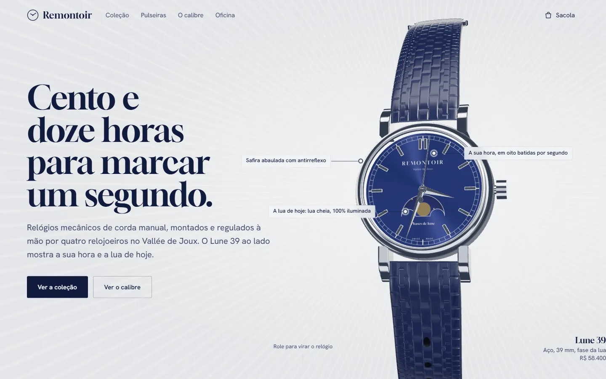
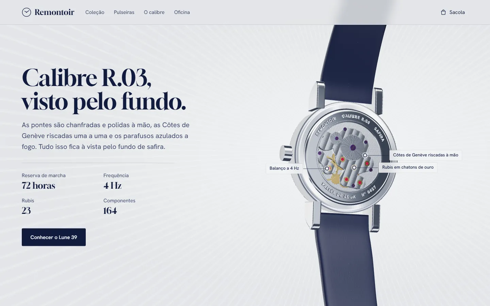
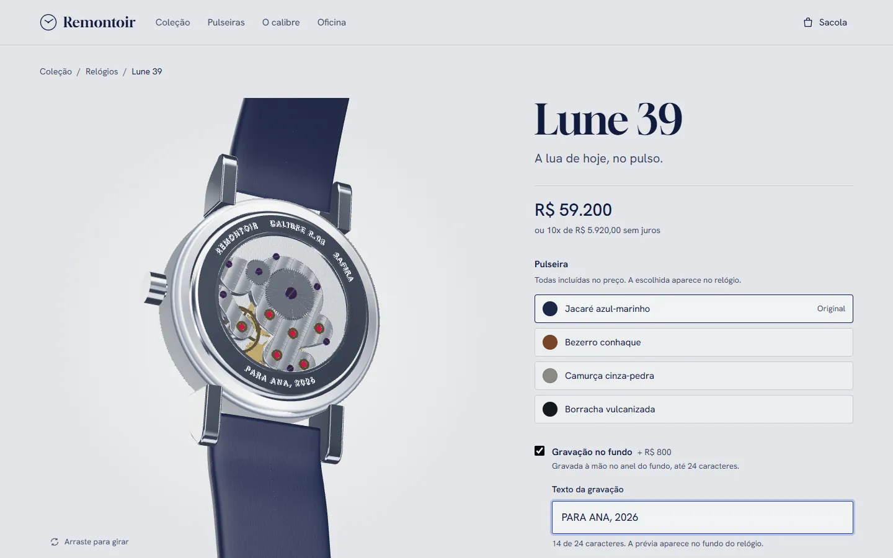
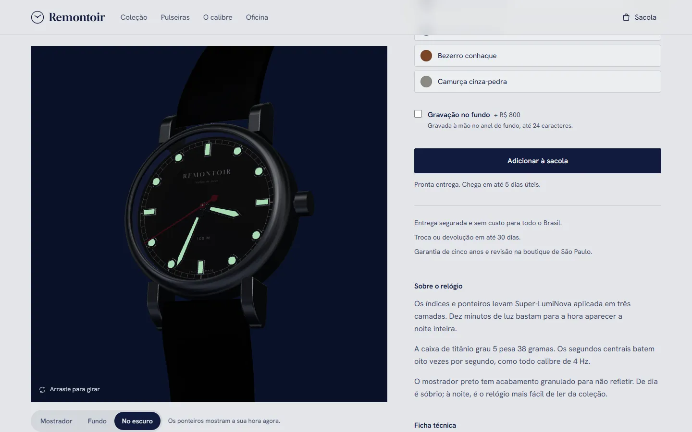

# Remontoir — relojoaria independente

Loja de relógios mecânicos, só frontend, feita como peça de portfólio. A marca, os relógios e os preços são fictícios; o código, o 3D e a experiência de compra são de verdade.

**Site no ar:** https://remontoir.vercel.app



## A ideia

A primeira dobra é um relógio 3D, feito inteiramente em código, que mostra **a hora de quem visita** (com os oito passos por segundo de um calibre de 4 Hz) e **a fase da lua de hoje**. Rolando a página, o relógio vira e mostra o movimento pelo fundo de safira: o balanço oscila de verdade, as pontes têm Côtes de Genève, os rubis ficam em chatons de ouro e os parafusos são azulados. Etiquetas com linhas de chamada apontam cada peça.

| O calibre pelo fundo | Gravação ao vivo no fundo | No escuro |
| --- | --- | --- |
|  |  |  |

## O que a loja faz

- **Home** com o relógio ao vivo, três peças em destaque (uma delas numa faixa escura com o lume acendendo), o gráfico das 112 horas de bancada, as pulseiras, garantia e lista de espera.
- **Coleção** com filtros por complicação, material da caixa e ordenação, tudo guardado na URL (dá para compartilhar um filtro). Passando o cursor, cada relógio mostra o fundo.
- **Página de produto** com visualizador 3D (girar, ver o mostrador, o fundo e o relógio no escuro), troca de pulseira refletida no modelo, **gravação no fundo desenhada no 3D enquanto você digita**, dados estruturados `Product` e peças relacionadas.
- **Sacola** em gaveta (`<dialog>` nativo) e em página, persistida no navegador.
- **Checkout** com máscara de CEP, celular e cartão, **endereço preenchido pelo ViaCEP**, Pix com 5% de desconto ou cartão em até 10x, validação com resumo de erros acessível e página de confirmação com um QR de demonstração. Nada sai do navegador.
- **404** com um mostrador parado às 4h04.

## Destaques técnicos

**3D procedural, sem modelos baixados.** Caixa, alças, coroa, mostrador, ponteiros, pulseira e movimento são gerados em código com three.js / React Three Fiber (`src/three`). Os acabamentos também: o raiado do mostrador usa um mapa de anisotropia radial, o guilhochê, a perlage, as Côtes de Genève, o jacaré e a camurça são mapas de normais gerados em canvas. A iluminação é um estúdio de painéis (`Lightformer`), sem baixar HDR.

**As fotos de produto saem do mesmo modelo.** `npm run render` abre cada produto numa rota de estúdio (`/render/[slug]`, fechada em produção), fotografa o canvas com o Playwright usando a GPU e grava WebP com transparência em `public/renders`. Os cards e pôsteres são imagens leves; o WebGL só carrega depois, em cima do pôster, sem salto de layout. O cartão de Open Graph é gerado do mesmo jeito.

**Desempenho.**
- Tudo é gerado estaticamente (SSG) e as imagens passam pelo `next/image` (AVIF/WebP).
- O canvas carrega sob demanda, quando o navegador está ocioso.
- O render pausa fora da tela e a resolução baixa em aparelhos lentos (`PerformanceMonitor`).
- Texturas e geometrias ficam em cache e as fontes são auto-hospedadas.
- As etiquetas do 3D são DOM comum, projetado a cada quadro, sem uma raiz React por etiqueta.

**Acessibilidade.**
- HTML semântico e link para pular ao conteúdo.
- Foco visível e rótulos em todos os campos.
- Erros ligados aos campos por `aria-describedby`.
- Anúncios da sacola em região `aria-live`.
- Respeito a `prefers-reduced-motion`.
- Contraste AA, verificado com axe nos testes.

**SEO.** Metadata por página, canonical, Open Graph e Twitter, `sitemap.xml`, `robots.txt`, manifest e JSON-LD (`Organization` e `Product`).

## Stack

Next.js 16 (App Router, Turbopack, React Compiler) · React 19 · TypeScript · Tailwind CSS 4 · three.js r182 · React Three Fiber 9 · drei 10 · Zustand 5 · Playwright + axe-core.

## Como rodar

```bash
npm install
npm run dev          # http://localhost:3100
```

Outros scripts:

| Script | O que faz |
| --- | --- |
| `npm run build` / `npm start` | build de produção e servidor em http://localhost:3110 |
| `npm run render` | com o `dev` rodando, refaz todas as imagens de produto e o cartão de Open Graph |
| `npm run test:e2e` | faz o build, sobe o servidor e roda os testes E2E em desktop e celular |
| `npm run docs:images` | converte as capturas dos testes nas imagens deste README |
| `npm run lint` / `npm run typecheck` | ESLint (com as regras do React Compiler) e TypeScript |

## Testes

Só testes de ponta a ponta, com Playwright, em dois perfis (desktop 1440×900 e Pixel 7). Eles cobrem:

- o relógio 3D carregando e virando com a rolagem;
- filtros e URL da coleção;
- pulseira e gravação indo para a sacola;
- persistência e totais da sacola;
- checkout com CEP simulado, Pix e cartão (incluindo número inválido) e confirmação;
- 404, `robots` e `sitemap`;
- `h1` único, `alt` em imagens e varredura de acessibilidade com axe em todas as páginas.

Cada execução deixa um artefato verificável: o relatório HTML em `e2e/report` e capturas de tela de todas as páginas em `e2e/screenshots`.

```
90 testes · 89 passaram · 1 pulado (o link de pular conteúdo, só no desktop)
```

## Estrutura

```
src/
  app/(site)/        páginas: home, coleção, produto, sacola, checkout
  app/render/        estúdio de fotos (só em desenvolvimento)
  components/        layout, home, produto, sacola, checkout, canvas 3D
  three/             o relógio: geometria, materiais, texturas, mostrador, movimento, pulseira
  data/              catálogo tipado
  lib/               sacola, filtros, máscaras, formatação
e2e/                 testes Playwright
scripts/             render de produtos e imagens do README
```

---

Projeto de portfólio de [Artur Guerra](https://arturguerra.com). Remontoir é uma marca fictícia.
